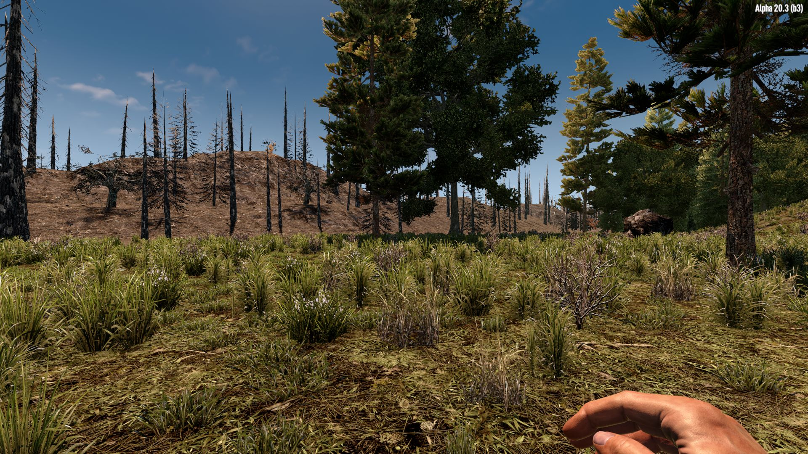
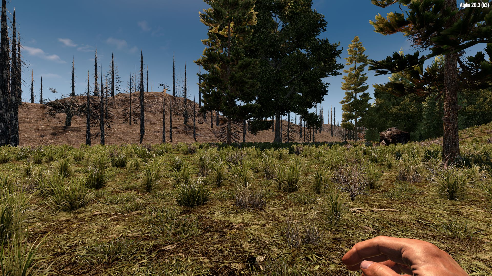
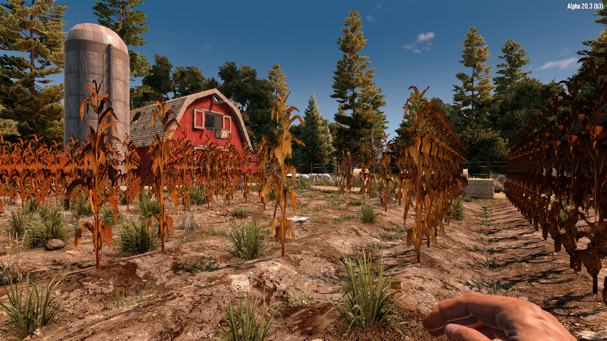
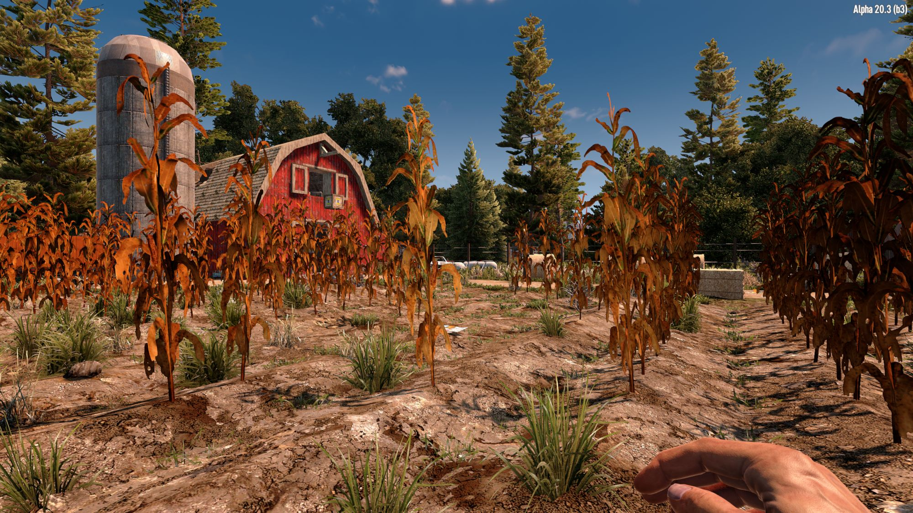

# OCB Crooked Deco Mod - 7 Days to Die (V2.0) Addon

This mod adds (small) random variations to decorations and blocks.
It alters scale and rotation for configured blocks within certain
ranges. These need to be setup individually in order to not mess
up visual rendering. It supports nearly all block model types,
except `Ext3dModel` and `ShapeNew` (may added in the future).

In the picture above you can see that the tree get slightly
crooked instead of each and every tree being straight as a
candle in the picture below (vanilla game version).

Another good example are corn fields, where the repeating pattern is
easily visible to the human eye. Only adding some slight variations
to each plant makes it look much more pleasant. Additionally you can
see the crooked Hay-Bales which also add some more realism (IMHO).
I hope I don't have to tell you which one is which :)

[![GitHub CI Compile Status][5]][4]

## Block Variation Settings

The whole setup can be configured via config files that life
inside the [`Settings`][2] folder (files ending with `.cfg`). The
setup has two phases, one is to configure the *variation types*.
Second is to map *Block names* to *variation types*.

### Variation Config

The format is `${TYPE}:${PASS};${OPT1};${OPT...}`, e.g.

`TrashPile:0;SCLXZ(0.85,1.2);RX2Y1Z2(15,45,15)`

This will configure the variation to be applied on pass 0.
Often pass 0 will work and you only need to increase this
if you find a block that only gets the variations applied on
another pass (trees being a prime example needing pass 3).

#### Repeatable Options

You can repeat as many options as you want, but normally you
at most need two, the scale and the rotation. The example
above will scale the x and z axis with a random factor
between 0.85 and 1.2 (with square distribution).

Additionally it will add a rotation in the range -7.5/+7.5
to the x-axis and z-axis, and -22.5/+22.5 in the y-axis.
The x- and z- axis has a square distribution, while the
y-axis has a normal distribution.

Square distributions will prefer the middle of the range.

### Variation Mapping

The format is `Map:${TYPE}:${REGEX}`, e.g.

`MAP:TrashPile:^cntTrashPile`

## Static Randomness

In order to support these variations I had to come up with
a static pseudo random number generator. We can't use regular
random number generators, since we need to ensure that we get
the same random number at the same map position each time.
To support this I create random numbers by using the block
positions, with some additional random seeds where needed.

## Console Commands

In order to ease testing there are quite a few console [commands
available][3] (bring up the console by hitting F1 in-game). Note
that already rendered blocks will not be updated. Only newly
created blocks will have the latest config applied.

- `crd reload`: Re-read all config files
- `crd list`: Last all crooked config types
- `crd find ${type}`: List blocks with `type`
- `crd get ${type}`: Get options for `type`
- `crd set ${type} ...`: Set options for `type`
- `crd block ${block} ${type}`: Set `block` to `type`

## Debug Mode F3 Panel Info

Use the debug mode (console `dm`) and F3 info panel
to see which crooked type a certain block has. Remember
to press left-shift to target the actual focused block.

### Download and Install

End-Users are encouraged to download my mods from [NexusMods][4].  
Every download there helps me to buy stuff for mod development.

Otherwise please use one of the [official releases][1] here.  
Only clone or download the repo if you know what you do!

## Changelog

### Version 0.6.0

- Update for 7D2D V2.0 (b295)

### Version 0.5.1

- Compatibility with V1 stable (b333)
- Fix minor issue with driftwood
- Add config for more rocks

### Version 0.5.0

- First compatibility with V1.0 (exp)

### Version 0.4.2

- Fix issue with short grass being to "pointy"
- Avoid re-randomization when ground is damaged
- Add crooking configs for 419 additional blocks
- Add crooked config info to F3 debug mode panel

### Version 0.4.1

- Fix issue with release zip archive for linux
  Settings folder was packed in lower-case
- Update ModInfo.xml to new V2 format

### Version 0.4.0

- Update compatibility for 7D2D A21.0(b313)

### Version 0.3.0

- Add hooks for BlockShapeNew to support crooked corn
- Change pseudo random number generator to xorshift*
- Tone down crookedness of spike traps

### Version 0.2.0

- Fix scales accumulating over time

### Version 0.1.0

- Initial version

[1]: https://github.com/OCB7D2D/A20BepInExPreloader
[3]: Library/CrookedDecoCmd.cs
[2]: Settings
[4]: https://github.com/OCB7D2D/OcbCrookedDeco/actions/workflows/ci.yml
[5]: https://github.com/OCB7D2D/OcbCrookedDeco/actions/workflows/ci.yml/badge.svg